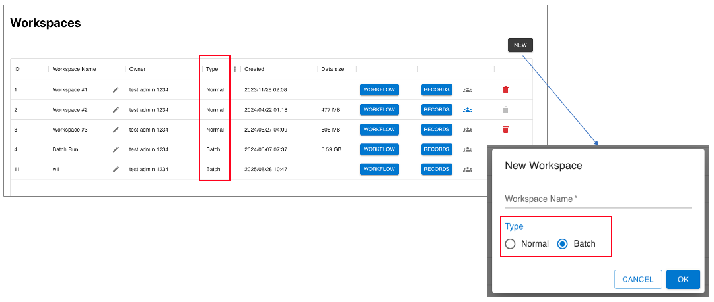
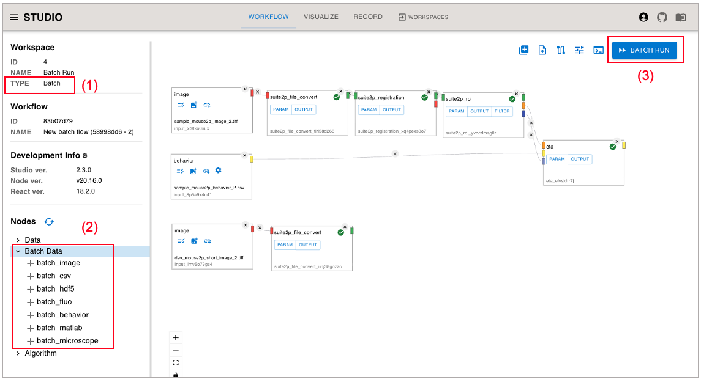
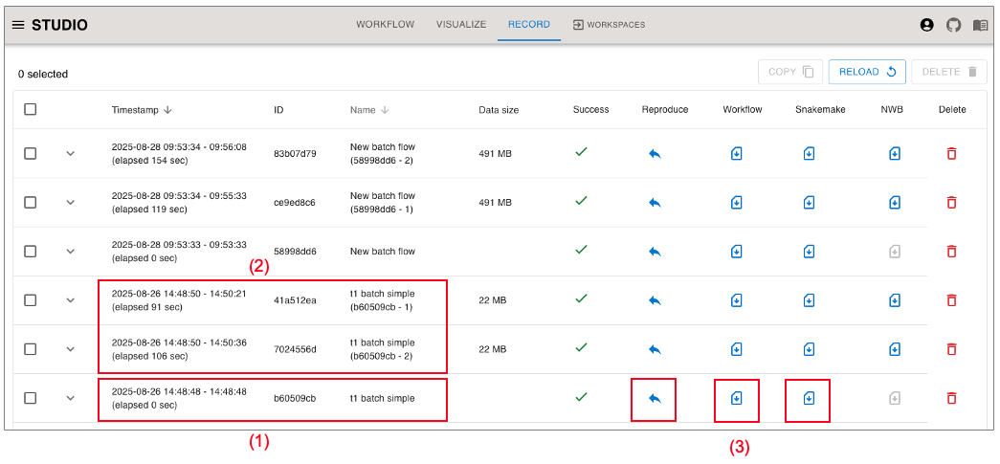

(workflow-batch-run)=
Workflow Batch Run
=================

By using the Workflow Batch Run function, you can batch-execute workflows set of input data.

\*This feature is limited to ["Multi User Mode"](host_for_multiuser/index.rst).

```{contents}
:depth: 3
```

## Usage Procedure

### Creating a Workspace (Batch Type)

<p>

</p>

- Specify the type of workspace as Batch when creating a Workspace.

### Batch Workspace specifics

Batch workspaces have the following UI changes:

<p>

</p>

- (1) Display Type: Batch
- (2) From the Batch Data section in the left side menu, you can select each Batch Input Node.
- (3) The "Run" button will display as the "Batch Run" button.

### Selecting Data

<p>

</p>

- (1) Batch Input Nodes
  - Place a Batch Input Node from "Batch Data" in the left side menu.
    - As an example, batch_image and batch_behavior are placed here.
  - Each Batch Input Node corresponds to a standard Input Node.
    - `batch_{image, csv, fluo, behavior, microscope, hdf5, matlab}`
- (2) File Select dialog
  - Each Batch Input Node can select multiple files.

```{eval-rst}
.. note::
    * **Data set handling**
        * Data are processed in the order they are selected.
            * All input data are matched based on their order, whereby image and behaviour in position 1 will be processed together, followed by all of the data in position 2, and so on.
            * Data in each node can be easily reordered by dragging up or down in the data list of that node.
    * **Validation rule**
        * Verify that the number of data in each Batch Input Data Node matches.
            * Only the number of data items is checked. File names and data contents are not checked.
```

### Setting dialogs

<p>

</p>

- (1) CSV Setting dialog
  - For CSV-based Nodes (`batch_{cvs, fluo, behavior}`), various settings can be made in the CSV Setting dialog.
  - In the CSV Setting dialog, **the contents of the first file** is previewed, and **same settings are applied to all files**.
- (2) Select Structure dialog
  - For Structured data type Nodes (`batch_{hdf5, matlab}`), the path of Input Data can be selected in the Select Structure dialog.
  - In the Select Structure dialog, **the contents of the first file (Structure)** is displayed, and **same settings are applied to all files**.
- (3) Node Param Setting
  - The parameter settings for each node apply **the same settings to all workflows**.

```{eval-rst}
.. note::
    * All workflows will complete with the **same parameter configuration**.
```

### Batch Run

<p>

</p>

#### Batch Run Button execution behavior

- Validation for Input Data
  - Check the number of items for each Batch Input Data
    - \***The only check condition is the number of items.** File names and data contents are not checked.
- Execute Batch Run
  - No reservations, immediate execution only
    - As soon as the process is successfully started, the Workflow will immediately have a completed status.
  - The following records are generated
    - Batch Workflow Template
      - Generate one Template Workflow as the basis of Running Workflow .
    - Batch Workflow
      - Automatically create Workflows for the number of Data items based on Batch Workflow Template and start parallel execution.

```{eval-rst}
..  note::
    * About workflow behavior after RUN BATCH
        * When submitting a RUN BATCH command, "the template workflow" then submits a new workflow (job) for each set of data.
        * The template workflow will be shown as successful if this job submission itself is successful. However, this does **not** mean any of the jobs themselves have been completed successfully.
        * The progress of each job can be seen in the RECORDS tab. Note that individual workflows run independently and some may still succeed or fail depending on the data contents and parameters selected.
```

## Record Screen

<p>

</p>

- (1) Record of Batch Workflow Template
  - Created when Batch Run Button is executed.
  - This Workflow does not run snakemake directly.
- (2) Record of Batch Workflow
  - Records of each workflow actually executed based on Batch Workflow Template
  - Same content as regular Workflow Record
  - "Name" is automatically generated based on the Template Name
- (3) Other menu of Batch Workflow Template
  - Reproduce ... Batch Workflow Template can be reproduced
  - Download workflow yaml ... You can also download and import Batch Workflow Template workflow.yaml
  - Download snakemake yaml ... It is not possible to download snakemake.yaml of Batch Workflow Template (because it is not subject to snakemake execution)
