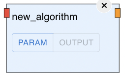
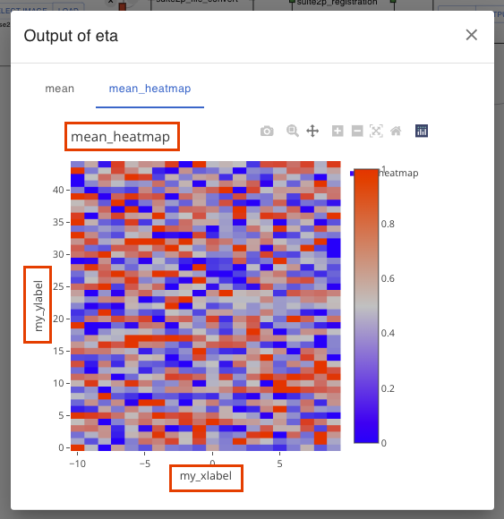

Add your own algorithm
==================

```{contents}
:depth: 3
```

## Example of Algorithm Addition Procedure

Below we describe an example procedure for adding a new algorithm.

**Prerequisite**
 - Sample Algorithm Name ... `new_algo`
 - Sample Algorithm Function Name ... `new_algo_func`
 - {OPTINIST_SRC_DIR}  ... Replace with the actual source storage directory path.


### 1. Prepare necessary directories and files for the algorithm

First, prepare the necessary directories and files for the algorithm.

- {OPTINIST_SRC_DIR}/studio/app/optinist/wrappers/
  - \_\_init__.py
  - xxxx/
  - yyyy/
  - ...
  - `new_algo/`    (*1)
      - \_\_init__.py      (*2)
      - `new_algo_func.py` (*3)
      - ...                (*4)

- Explanation:
  - (*1) The name is arbitrary, but `{algorithm name}` is the standard.
  - (*2) Empty first.
  - (*3) Empty first.
  - (*4) Prepare other files to be added.

### 2. Algorithm implementation

#### Import statement description

- Target file
  - {OPTINIST_SRC_DIR}/studio/app/optinist/wrappers/`new_algo`/`new_algo_func`.py

```python
from studio.app.common.dataclass import *
```

- Explanation:
  - If the required dataclass does not exist, you can add your own.
  - see. [DataClass](#dataclass)


#### Define the Input/Output of the function and implement the logic.

- Target file
  - {OPTINIST_SRC_DIR}/studio/app/optinist/wrappers/`new_algo_wrapper`/`new_algo_func`.py

The function code is described below.

```python
def new_algo_func(               # (*1)
        image_data: ImageData,   # (*2)
        output_dir: str,         # (*3)
        params: dict=None        # (*4)
        **kwargs,                # (*3)
    ) -> dict(fluo=FluoData):    # (*5)
    import numpy as np
    info = {
        "fluo": FluoData(np.random.rand(100, 20), file_name="fluo"),
        "image": ImageData(np.random.rand(10, 100, 100), file_name="image"),
        "heatmap": HeatMapData(np.random.rand(20, 20), file_name="heatmap")
    }
    return info
```

- Explanation:
  - (*1) Function name can be any content.
  - (*2) The first argument specifies the input data type. (This is also reflected in the GUI.)
  - (*3) Add these arguments. These arguments are required for the handling workflow.
  - (*4) This argument receives the function parameters.
    - see. [Function Parameter Definitions](#function-parameter-definitions)
  - (*5) The return value is a dictionary type. (This is also reflected in the GUI.)

#### Definition of information to be displayed in the GUI

- Target file
  - {OPTINIST_SRC_DIR}/studio/app/optinist/wrappers/`new_algo`/\_\_init__.py

```python
from studio.app.optinist.wrappers.new_algo.new_algo_func import new_algo_func

new_algo_wrapper_dict = {                       # (*1)
    'new_algo': {                               # (*2)
        'new_algo_func': {                      # (*3)
            'function': new_algo_func,          # (*4)
            'conda_name': 'new_algo',           # (*5)
        },
    }
}
```

- Explanation:
  - (*1) The variable name is arbitrary, but `{algorithm_name}_wrapper_dict` is the standard.
  - (*2) Algorithm name can be any text (display label to GUI)
  - (*3) Algorithm function name can be any text (display label to GUI)
  - (*4) Algorithm function name specifies the actual function name
  - (*4, 5) The conda setting is optional (to be defined when using conda with snakemake)


### 3. Algorithm Registration

Register the created algorithm to the application by adding the following settings.

- Target file
  - {OPTINIST_SRC_DIR}/studio/app/optinist/wrappers/\_\_init__.py

```python
from studio.app.optinist.wrappers.xxxx import xxxx_wrapper_dict
from studio.app.optinist.wrappers.yyyy import yyyy_wrapper_dict
...
from studio.app.optinist.wrappers.new_algo import new_algo_wrapper_dict    # <-- Add

wrapper_dict = {}
wrapper_dict.update(**xxxx_wrapper_dict)
wrapper_dict.update(**yyyy_wrapper_dict)
...
wrapper_dict.update(**new_algo_wrapper_dict)    # <-- Add
```

After the registration process up to this point, restart the application browser to confirm that the algorithm has been added.


## Detailed Explanations

### DataClass

Optinist defines several DataClasses to ensure consistency between Input and Output types. The main data types are as follows. These correspond to the color of each Node's handle.

Optinist support datatype.

- ImageData
- TimeSeriesData
- FluoData
- BehaviorData
- IscellData
- Suite2pData
- ScatterData
- BarData

### Input & Output handle

In the following example, the **new_algo_func** function takes **ImageData** and returns **FluoData**.

```python
from studio.app.common.dataclass import *

def new_algo_func(
        image_data: ImageData,
        output_dir: str,
        params: dict=None,
        **kwargs,
    ) -> dict(fluo=FluoData):
    return
```

Restart the Application and place **new_algo_func** on the GUI , and you will see that the handle color has changed.



### Function Parameter Definitions

Function input parameters (input on GUI) can be defined in the following file.

- {OPTINIST_SRC_DIR}/studio/app/optinist/wrappers/`new_algo`/params/{algorithm_function_name}.yaml

- Sample:
  ```yaml
  new_algo_params_1:
    filtersize1: 10
    filtersize2: 20
  new_algo_params_2:
    filtersize3: 30
    filtersize4: 40
  ```

- Explanation:
  - {algorithm_function_name} must match the actual function name.


### Drawing output results

- Above we described the node input and output handle, here we describe the visualization of the result.
- The output of the function is a dictionary. (Here we use the variable **info**.)
- First, the **fluo** variable that is the return value of the **new_algo_func function** is output by Wrap with **FluoData**. The name of the key in this case must match the **fluo** of the return value when declaring the function.
- In addition, variables to be visualized are wrapped with their data types and output. In this example, **ImageData** and **HeatMap** are output.

```python
def new_algo_func(
        image_data: ImageData,
        output_dir: str,
        params: dict=None,
        **kwargs,
    ) -> dict(fluo=FluoData):
    import numpy as np
    info = {
        "fluo": FluoData(np.random.rand(100, 20), file_name="fluo"),
        "image": ImageData(np.random.rand(10, 100, 100), file_name="image"),
        "heatmap": HeatMapData(np.random.rand(20, 20), file_name="heatmap")
    }
    return info
```

Restart the Application, connect imageNode and run it, and you will see the output as follows.

- Note:
  - This is a quick process (only a few seconds), so if the process does not terminate, an error may have occurred. If the error persists, please submit a question to the issue.


<style>
img { width: 50%; }
</style>

#### Customize plot metadata

You can set plot title and axis labels to some output.



To do this,

1. import PlotMetaData in the algorithm function file.
2. Add PlotMetaData to the output dataclass's `meta` attribute with title or labels you want. If you need only one of them, you can omit the other attributes.
    ```python
    from studio.app.common.schemas.outputs import PlotMetaData

    def new_algo_func(
        image_data: ImageData,
        output_dir: str,
        params: dict=None,
        **kwargs,
    ) -> dict(fluo=FluoData):
      import numpy as np
      info = {
          "fluo": FluoData(
            np.random.rand(100, 20), file_name="fluo"
            meta=PlotMetaData(
              title="my fluo",
              xlabel="my xlabel",
              ylabel="my ylabel",
          ),
          "image": ImageData(np.random.rand(10, 100, 100), file_name="image"),
          "heatmap": HeatMapData(
            np.random.rand(20, 20),
            file_name="heatmap",
            meta=PlotMetaData(
              title="my heatmap",  # You don't have to set all attributes
            )
          )
      }
      return info
    ```

    ```{eval-rst}
    .. note::
        Following dataclasses are not supported to visualize these metadata.

        - CsvData
        - HTMLData
    ```
